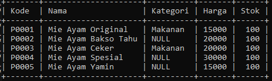

# Alias

## Alias

- MySQL memiliki fitur untuk melakukan alias untuk kolom dan tabel
- Alias berguna jika kita ingin mengubah nama kolom atau nama tabel ketika melakukan SELECT data
- Mungkin saat ini alias untuk tabel tidak terlalu terlihat gunanya, tapi nanti ketika kita telah mempelajari tentang JOIN, maka fitur alias untuk tabel sangat berguna sekali

---

## Alias untuk Kolom

```sql
SELECT id AS 'Kode',
    name AS 'Nama',
    category AS 'Kategori',
    price AS 'Harga',
    quantity AS 'Stok'
FROM products;
```

**Hasil :**



---

## Alias untuk Tabel

```sql
SELECT p.id AS 'Kode',
    p.name AS 'Nama',
    p.category AS 'Kategori',
    p.price AS 'Harga',
    p.quantity AS 'Stok'
FROM products AS p;
```

**Hasil :**

