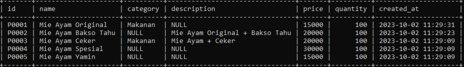
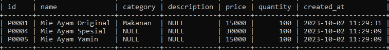
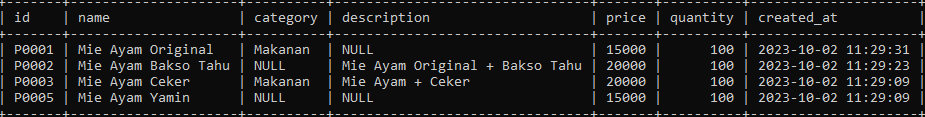
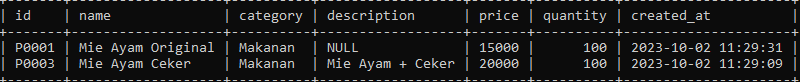

# Where Operator

## Where Operator

- Sebelumnya di materi where clause kita sudah menggunakan operator = (sama dengan)
- Sebenarnya sangat banyak sekali operator yang bisa kita gunakan ketika menggunakan where clause
- Sekarang kita akan bahas satu per satu

---

## Operator Perbandingan

<table border="1" width="100%">
    <tr>
        <th>Operator</th>
        <th>Keterangan</th>
    </tr>
    <tr>
        <td>=</td>
        <td>Sama dengan1</td>
    </tr>
    <tr>
        <td><></td>
        <td>atau != Tidak sama dengan</td>
    </tr>
    <tr>
        <td><</td>
        <td>Kurang dari</td>
    </tr>
    <tr>
        <td><=</td>
        <td>Kurang dari atau sama dengan</td>
    </tr>
    <tr>
        <td>></td>
        <td>Lebih dari</td>
    </tr>
    <tr>
        <td>>=</td>
        <td>Lebih dari atau sama dengan</td>
    </tr>
</table>

---

## Mencari Data dengan Operator Perbandingan

```sql
SELECT id, name, price, quantity
FROM products
WHERE quantity > 100;
```
---

## AND dan OR Operator

- Kadang kita ingin mencari data dengan beberapa gabungan kondisi, kita bisa menggunakan operator AND dan OR
- AND dan OR digunakan untuk menggabungkan beberapa dua operator

---

## Hasil Operator AND

<table border="1" width="100%">
    <tr>
        <th>Hasil Operator 1</th>
        <th>Operator</th>
        <th>Hasil Operator 2</th>
        <th>Hasil Akhir</th>
    </tr>
    <tr>
        <td>Benar</td>
        <td>AND</td>
        <td>Benar</td>
        <td>Benar</td>
    </tr>
    <tr>
        <td>Salah</td>
        <td>AND</td>
        <td>Benar</td>
        <td>Salah</td>
    </tr>
    <tr>
        <td>Benar</td>
        <td>AND</td>
        <td>Salah</td>
        <td>Salah</td>
    </tr>
    <tr>
        <td>Salah</td>
        <td>AND</td>
        <td>Salah</td>
        <td>Salah</td>
    </tr>
</table>

---

## Mencari Data dengan Operator AND

```sql
SELECT id, name, price, quantity
FROM products
WHERE quantity > 100 AND price > 100000;
```
---

## Hasil Operator OR

<table border="1" width="100%">
    <tr>
        <th>Hasil Operator 1</th>
        <th>Operator</th>
        <th>Hasil Operator 2</th>
        <th>Hasil Akhir</th>
    </tr>
    <tr>
        <td>Benar</td>
        <td>OR</td>
        <td>Benar</td>
        <td>Benar</td>
    </tr>
    <tr>
        <td>Salah</td>
        <td>OR</td>
        <td>Benar</td>
        <td>Benar</td>
    </tr>
    <tr>
        <td>Benar</td>
        <td>OR</td>
        <td>Salah</td>
        <td>Benar</td>
    </tr>
    <tr>
        <td>Salah</td>
        <td>OR</td>
        <td>Salah</td>
        <td>Salah</td>
    </tr>
</table>

---

## Mencari Data dengan Operator OR

```sql
SELECT id, name, price, quantity
FROM products
WHERE quantity > 500 OR price > 10000;
```

---

## Prioritas dengan Kurung ()

```sql
SELECT id, name, price, quantity
FROM products
WHERE (category = 'Makanan' OR quantity > 500) AND price > 10000;
```

---

## LIKE Operator
- LIKE operator adalah operator yang bisa kita gunakan untuk mencari sebagian data dalam String
- Ini cocok sekali ketika kita hanya ingin mencari sebagian kata dalam String
- Namun perlu diingat, operasi LIKE itu sangat lambat, oleh karena itu, tidak disarankan jika datanya sudah terlalu besar di tabel
- Operasi LIKE tidak case sensitive, jadi huruf besar dan kecil tidak akan berpengaruh

---

## Hasil Operator LIKE

<table border="1" width="100%">
    <tr>
        <th>LIKE</th>
        <th>Operator Hasil</th>
    </tr>
    <tr>
        <td>LIKE ‘b%’</td>
        <td>String dengan awalan b</td>
    </tr>
    <tr>
        <td>LIKE ‘%a’</td>
        <td>String dengan akhiran b</td>
    </tr>
    <tr>
        <td>LIKE ‘%eko%’</td>
        <td>String berisi eko</td>
    </tr>
    <tr>
        <td>NOT LIKE</td>
        <td>Tidak LIKE</td>
    </tr>
</table>

---

## Mencari Menggunakan LIKE Operator

```sql
SELECT *
FROM products
WHERE name LIKE '%mie%';
```

**Hasil :**



---

## NULL Operator

- Untuk mencari data yang berisi NULL, kita tidak bisa menggunakan operator perbandingan = NULL.
- Ada operator khusus untuk mencari data NULL, yaitu menggunakan NULL operator
- IS NULL, artinya mencari yang NULL
- IS NOT NULL, artinya mencari yang tidak NULL

---

## Mencari Menggunakan NULL Operator

```sql
SELECT *
FROM products
WHERE description IS NULL;
```

**Hasil :**



---

## BETWEEN Operator

- Kadang kita ingin mencari data yang >= dan <= secara sekaligus
- Misal kita ingin mencari products yang harganya antara 10000 sampai 20000
- Untuk melakukan ini, kita bisa menggunakan WHERE price >= 10000 AND price <= 20000
- Namun ada operator BETWEEN yang bisa kita gunakan agar lebih sederhana
- Untuk kebalikannya, kita bisa gunakan NOT BETWEEN

---

## Mencari Menggunakan BETWEEN Operator

```sql
SELECT *
FROM products
WHERE price BETWEEN 10000 AND 20000;
```

**Hasil :**



---

## IN Operator

- Operator IN adalah operator untuk melakukan pencarian sebuah kolom dengan beberapa nilai.
- Misal kita ingin mencari products dengan category Makanan atau Minuman, maka kita bisa menggunakan operator IN

---

## Mencari Menggunakan IN Operator

```sql
SELECT *
FROM products
WHERE category IN ('Makanan', 'Minuman');
```

**Hasil :**


