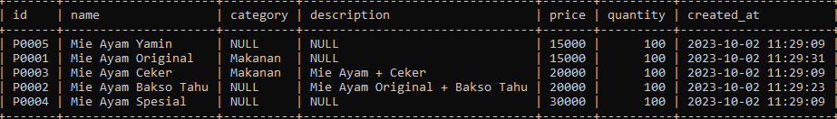

# Order By Clause

## Order By Clause

- Untuk mengurutkan data ketika kita menggunakan perintah SQL SELECT, kita bisa menambahkan ORDER BY clause
- ORDER BY clause digunakan untuk mengurutkan data berdasarkan kolom yang dipilih, dan jenis urutan (ASC atau DESC)
- Kita juga bisa mengurutkan tidak hanya terhadap satu kolom, tapi beberapa kolom 

---

## Mengurutkan Data

```sql
SELECT *
FROM products
ORDER BY price ASC, id DESC;
<<<<<<< HEAD
```

**Hasil :**


=======
```
>>>>>>> ff260bcfa7bfe76000535b6d9093310382979768
