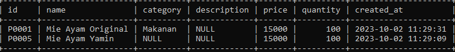
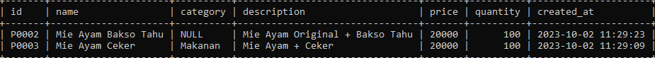

# Limit Clause

## Limit Clause

- Mengambil seluruh data di tabel bukanlah pilihan bijak, apalagi jika datanya sudah banyak sekali
- Kita bisa membatasi jumlah data yang diambil dalam SQL SELECT dengan LIMIT clause
- Selain membatasi jumlah data, kita juga bisa meng-skip sejumlah data yang tidak ingin kita lihat
- LIMIT biasanya digunakan saat melakukan paging di aplikasi kita

---

## Membatasi Hasil Query

```sql
SELECT *
FROM products
WHERE price > 0
ORDER BY price
LIMIT 2;
```

<<<<<<< HEAD
**Hasil :**



=======
>>>>>>> ff260bcfa7bfe76000535b6d9093310382979768
---

## Skip Hasil Query

```sql
SELECT *
FROM products
WHERE price > 0
ORDER BY price
LIMIT 2, 2;
<<<<<<< HEAD
```

**Hasil :**


=======
```
>>>>>>> ff260bcfa7bfe76000535b6d9093310382979768
