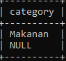

# Select Distinct Data

## Select Distinct Data

- Saat melakukan query dengan SELECT, kadang kita mendapatkan data yang duplikat
- Misal kita ingin melihat semua kategori di tabel products, maka otomatis hasil query SELECT akan duplikat, karena banyak sekali produk dengan kategori yang sama
- Jika kita ingin menghilangkan data-data duplikat tersebut , kita bisa menggunakan SELECT dengan tambahan DISTINCT sebelum nama kolom nya

---

## Menghilangkan Data Duplikat

```sql
SELECT distinct category
FROM products;
<<<<<<< HEAD
```

**Hasil :**


=======
```
>>>>>>> ff260bcfa7bfe76000535b6d9093310382979768
