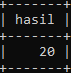

# Numeric Function

## Numeric Function

- MySQL memiliki banyak sekali fitur untuk manipulasi data angka
- Hal ini memudahkan kita untuk memanipulasi data angka
- Secara garis besar, fitur ini dibagi menjadi dua, Arithmetic Operator dan Mathematical Function

---

## Arithmetic Operator

<table border="1" width="100%">
    <tr>
        <th>Nama</th>
        <th>Keterangan</th>
    </tr>
    <tr>
        <td>%, MOD</td>
        <td>Modulo operator</td>
    </tr>
    <tr>
        <td>*</td>
        <td>Multiplication Operator</td>
    </tr>
    <tr>
        <td>+</td>
        <td>Addition Operator</td>
    </tr>
    <tr>
        <td>-</td>
        <td>Minus Operator</td>
    </tr>
    <tr>
        <td>-(minus didepan angka)</td>
        <td>Change the sign of the argument</td>
    </tr>
    <tr>
        <td>/</td>
        <td>Division Operator</td>
    </tr>
    <tr>
        <td>DIV</td>
        <td>Integer Division</td>
    </tr>
</table>

---

## Menggunakan Arithmetic Operator

```sql
SELECT 10 + 10 AS hasil;

SELECT id, price DIV 1000 AS 'Price in K'
FROM products;
```

**Hasil :**




---

## Mathematical Function

- Selain arithmetic operator, ada juga mathematical function
- Ini adalah kumpulan function yang terdapat di MySQL yang bisa kita gunakan sebagai fungsi-fungsi matematika
- Ada banyak sekali, dan tidak bisa kita bahas semua
- https://dev.mysql.com/doc/refman/8.0/en/mathematical-functions.html

---

## Menggunakan Mathematical Function

```sql
SELECT PI();

SELECT POWER(10, 2);

SELECT COS(10);
SELECT SIN(10);
SELECT TAN(10);
```