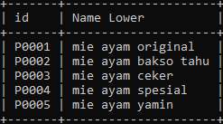

# String Function

## String Function

- Sama seperti number, di MySQL juga banyak menyediakan function untuk tipe data String
- Ada banyak sekali function-function yang bisa kita gunakan
- https://dev.mysql.com/doc/refman/8.0/en/string-functions.html

---

## Menggunakan String Function

```sql
SELECT id, LOWER(name) AS 'Name Lower'
FROM products;

SELECT id, name, LENGTH(name) AS 'Name Length'
FROM products;
```

**Hasil :**




