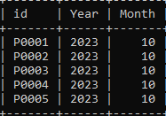
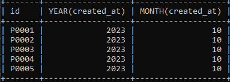

# Date and Time Functions

---

## Date dan Time Function

- MySQL juga menyediakan banyak sekali function yang bisa kita gunakan untuk mengolah data tipe Date dan Time
- https://dev.mysql.com/doc/refman/8.0/en/date-and-time-functions.html

---

## Menambah Kolom Timestamp

```sql
SELECT id,
    EXTRACT(YEAR FROM created_at) AS 'Year',
    EXTRACT(MONTH FROM created_at) AS 'Month'
FROM products;
```

**Hasil :**



```sql
SELECT id, YEAR(created_at), MONTH(created_at)
FROM products;
```

**Hasil :**


