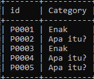
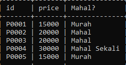
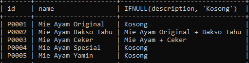

# Flow Control Function

## Flow Control Function

- MySQL memiliki fitur flow control function
- Ini mirip IF ELSE di bahasa pemrograman
- Tapi ingat, fitur ini tidak se kompleks yang dimiliki bahasa pemrograman
- https://dev.mysql.com/doc/refman/8.0/en/flow-control-functions.html

---

## Menggunakan Control Flow CASE

```sql
SELECT id,
    CASE category
        WHEN 'Makanan' THEN 'Enak'
        WHEN 'Minuman' THEN 'Segar'
        ELSE 'Apa itu?'
        END AS 'Category'
FROM products;
```

**Hasil :**



---

## Menggunakan Control Flow IF

```sql
SELECT id, price,
    IF(price <= 15000, 'Murah',
        IF(price <= 20000, 'Mahal', 'Mahal Sekali')
    ) AS 'Mahal?'
FROM products;
```

**Hasil :**



---

## Menggunakan Control Flow IFNULL

```sql
SELECT id, name, IFNULL(description, 'Kosong')
FROM products;
```

**Hasil :**


