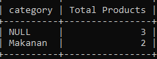

# Grouping

## GROUP BY

- Kadang saat melakukan aggregate, kita ingin datanya di grouping berdasarkan kriteria tertentu
- Misal kita ingin melihat rata-rata harga product, tapi ingin per category
- Atau kita ingin melihat total semua product, tapi per category
- Hal ini bisa dilakukan di MySQL dengan menggunakan GROUP BY clause
- GROUP BY clause ini hanya bisa digunakan jika kita menggunakan aggregate function
- https://dev.mysql.com/doc/refman/8.0/en/group-by-modifiers.html

---

## Menggunakan GROUP BY

```sql
SELECT category, COUNT(id) AS 'Total Products'
FROM products
GROUP BY category;
```

**Hasil :**



---

## HAVING Clause

- Kadang kita ingin melakukan filter terhadap data yang sudah kita grouping
- Misal kita ingin menampilkan rata-rata harga per kategori, tapi yang harganya diatas 10.000 misalnya
- Jika menggunakan WHERE di SELECT, hal ini tidak bisa dilakukan
- Untuk memfilter hasil aggregate function, kita harus menggunakan HAVING clause

---

## Menggunakan HAVING Clause

```sql
SELECT category, COUNT(id) AS total
FROM products
GROUP BY category
HAVING total > 2;
```

**Hasil :**


