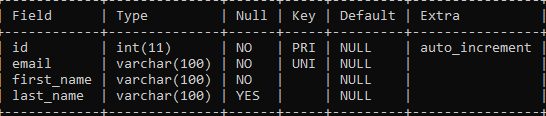

# Constraint

## Constraint

- Di MySQL, kita bisa menambahkan constraint untuk menjaga data di tabel tetap baik
- Constraint sangat bagus ditambahkan untuk menjaga terjadi validasi yang salah di program kita, sehingga data yang masuk ke database tetap akan terjaga

---

## Unique Constraint

- Unique constraint adalah constraint yang memastikan bahwa data kita tetap unique
- Jika kita mencoba memasukkan data yang duplikat, maka MySQL akan menolak data tersebut

---

## Membuat Table dengan Unique Constraint

```sql
CREATE TABLE customers
(
    id INT NOT NULL AUTO_INCREMENT,
    email VARCHAR(100) NOT NULL,
    first_name VARCHAR(100) NOT NULL,
    last_name VARCHAR(100),
    PRIMARY KEY (id),
    UNIQUE KEY email_unique (email)
) ENGINE = InnoDB;
```

**Hasil :**



---

## Menambah/Menghapus Unique Constraint

```sql
ALTER TABLE customers
    ADD CONSTRAINT email_unique UNIQUE (email);

ALTER TABLE customers
    DROP COSNTRAINT email_unique;
```

---

## Check Constraint

- Check constraint adalah constraint yang bisa kita tambahkan kondisi pengecekannya
- Ini cocok untuk mengecek data sebelum dimasukkan ke dalam database
- Misal kita ingin memastikan bahwa harga harus diatas 1000 misal
- Maka kita bisa menggunakan check constraint

---

## Membuat Table dengan Check Constraint

```sql
CREATE TABLE products
(
    id VARCHAR(10) NOT NULL,
    name VARCHAR(100) NOT NULL,
    description TEXT,
    price INT UNSIGNED NOT NULL,
    quantity INT UNSIGNED NOT NULL DEFAULT 0,
    created_at TIMESTAMP NOT NULL DEFAULT CURRENT_TIMESTAMP,
    PRIMARY KEY(id),
    CONSTRAINT price_check CHECK (price >= 1000)
) ENGINE = InnoDB;
```

---

## Menambah/Menghapus Check Constraint


```sql
ALTER TABLE products
    ADD CONSTRAINT price_check CHECK (price >= 1000);

ALTER TABLE products
    DROP CONSTRAINT price_check;
```