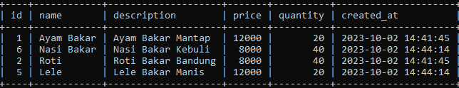
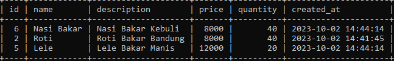
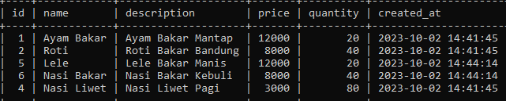

# Full-Text Search

## Masalah dengan LIKE operator

- Kadang kita ingin mencari sebuah kata dalam tabel, dan biasanya kita akan menggunakan LIKE operator
- Operasi yang dilakukan LIKE operator adalah dengan cara mencari seluruh data di tabel dari baris pertama sampai terakhir, hal ini membuat operasi LIKE sangat lambat
- Menambah index di tabel juga tidak akan membantu, karen LIKE operator tidak menggunakan index
- MySQL menyediakan fitur Full Text Search jika ada kasus kita ingin melakukan hal ini

---

## Full-Text Search

- Full-Text Search memungkinkan kita bisa mencari sebagian kata di kolom dengan tipe data String
- Ini sangat cocok ketika pada kasus kita memang membutuhkan pencarian yang tidak hanya sekedar operasi = (equals, sama dengan)
- https://dev.mysql.com/doc/refman/8.0/en/fulltext-search.html

---

## Membuat Table dengan Full-Text Search

```sql
CREATE TABLE products
(
    id VARCHAR(10) NOT NULL,
    name VARCHAR(100) NOT NULL,
    description TEXT,
    price INT UNSIGNED NOT NULL,
    quantity INT UNSIGNED NOT NULL DEFAULT 0,
    created_at TIMESTAMP NOT NULL DEFAULT CURRENT_TIMESTAMP,
    PRIMARY KEY (id),
    FULLTEXT product_search (name, description)
) ENGINE = InnoDB;
```

---

## Menambah/Menghapus Full-Text Search

```sql
ALTER TABLE products
    ADD FULLTEXT product_search (name, description);

ALTER TABLE products
    DROP INDEX product_search;
```

---

## Mode Full-Text Search

MySQL menyediakan beberapa mode untuk melakukan pencarian di Full-Text Search, kita bisa
memilihnya sesuai kebutuhan kita
- Natural Language, yaitu mencari seperti bahasa natural (per kata) :
    https://dev.mysql.com/doc/refman/8.0/en/fulltext-natural-language.html
- Boolean, yaitu mencari dengan kemampuan mengandung kata (+) atau tidak mengandung kata (-) dan lain-lain : 
    https://dev.mysql.com/doc/refman/8.0/en/fulltext-boolean.html
- Query Expansion, yaitu mencari seperti natural language, namun melakukan dua kali pencarian, pencarian pertama menggunakan natural language, pencarian kedua melakukan pencarian dari kedekatan hasil pertama, misal kita mencari kata “bakso”, lalu ternyata di dalam “bakso” ada kata “mie”, maka kemungkinan query kedua akan mencari kata “mie” juga :
    https://dev.mysql.com/doc/refman/8.0/en/fulltext-query-expansion.html

---

## Mencari dengan Natural Language Mode

```sql
SELECT *
FROM products
WHERE MATCH(name, description)
    AGAINST('bakar' IN NATURAL LANGUAGE MODE);
```

**Hasil :**



---

## Mencari dengan Boolean Mode

```sql
SELECT * 
FROM products
WHERE MATCH(name, description)
    AGAINST('+bakar -ayam' IN BOOLEAN MODE);
```

**Hasil :**



---

## Mencari dengan Query Expansion Mode

```sql
SELECT *
FROM products
WHERE MATCH(name, description)
    AGAINST('bakar' WITH QUERY EXPANSION);
```

**Hasil :**

