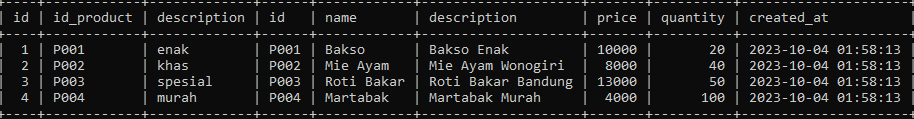
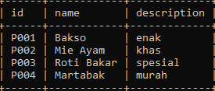
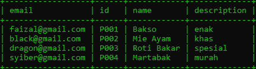

# Join

## Join

- MySQL mendukung query SELECT langsung ke beberapa tabel secara sekaligus
- Namun untuk melakukan itu, kita perlu melakukan JOIN di SQL SELECT yang kita buat
- Untuk melakukan JOIN, kita perlu menentukan tabel mana yang merupakan referensi ke tabel lain
- Join cocok sekali dengan foreign key, walaupun di MySQL tidak ada aturan kalau JOIN harus ada foreign key
- Join di MySQL bisa dilakukan untuk lebih dari beberapa tabel
- Tapi ingat, semakin banyak JOIN, maka proses query akan semakin berat dan lambat, jadi harap bijak ketika melakukan JOIN
- Idealnya kita melakukan JOIN jangan lebih dari 5 tabel, karena itu bisa berdampak ke performa query yang lambat

---

## Melakukan JOIN Table

```sql
SELECT * FROM wishlist
JOIN products ON (wishlist.id_product = products.id);
```

**Hasil :**



```sql
SELECT products.id, products.name, wishlist.description
FROM wishlist
JOIN products ON (products.id = wishlist.id_product);
```

**Hasil :**



---

## Membuat Relasi ke Table Customers

```sql
ALTER TABLE wishlist
    ADD COLUMN id_customer INT;

ALTER TABLE wishlist
ADD CONSTRAINT fk_wishlist_customer
FOREIGN KEY (id_customer) REFERENCES customer(id);
```

---

## Melakukan JOIN Multiple Table

```sql
SELECT customers.email, products.id, products.name, wishlist.description
FROM wishlist
JOIN products ON (products.id = wishlist.id_product)
JOIN customers ON (customers.id = wishlist.id_customer);
```

**Hasil :**

