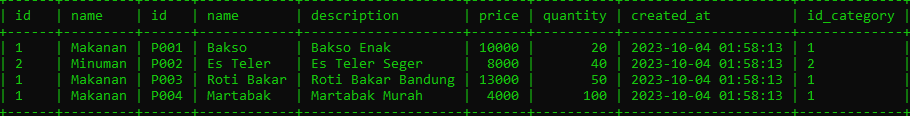

# Jenis-Jenis Join

---

## Jenis-Jenis Join

Sebelumnya kita sudah bahas tentang JOIN table, tapi sebenarnya ada banyak sekali jenis-jenis JOIN table di MySQL, diantaranya :
- INNER JOIN
- LEFT JOIN
- RIGHT JOIN
- CROSS JOIN

---

## Inner Join

- INNER JOIN adalah mekanisme JOIN, dimana terdapat relasi antara tabel pertama dan tabel kedua
- Jika ada data di tabel pertama yang tidak memiliki relasi di table kedua ataupun sebaliknya, maka hasil INNER JOIN tidak akan ditampilkan
- Ini adalah default JOIN di MySQL
- Jika kita menggunakan JOIN seperti yang sudah kita praktekan sebelumnya, sebenarnya itu akan melakukan INNER JOIN
---

## Inner Join Diagram


---

## Melakukan Inner Join

```sql
SELECT * FROM categories
INNER JOIN products ON (products.id_category = categories.id);
```

**Hasil :**


---

## Left Join

- LEFT JOIN adalah mekanisme JOIN seperti INNER JOIN, namun semua data di table pertama akan diambil juga
- Jika ada yang tidak memiliki relasi di table kedua, maka hasilnya akan NULL

---

## Left Join Diagram


---

## Melakukan Left Join

```sql
SELECT * FROM categories
LEFT JOIN products ON (products.id_category = categories.id);
```

**Hasil :**


---

## Right Join

- RIGHT JOIN adalah mekanisme JOIN seperti INNER JOIN, namun semua data di table kedua akan diambil juga
- Jika ada yang tidak memiliki relasi di table pertama, maka hasilnya akan NULL

---

## Right Join Diagram


---

## Melakukan Right Join

```sql
SELECT * FROM categories
RIGHT JOIN products ON (products.id_category = categories.id);
```

**Hasil :**



---

## Cross Join

- CROSS JOIN adalah salah satu JOIN yang sangat jangan sekali digunakan
- CROSS JOIN adalah melakukan join dengan cara mengkalikan data di tabel pertama dengan dada di table kedua
- Artinya jika ada 5 data di tabel pertama, dan 5 data di tabel kedua, akan menghasilkan 25 kombinasi data (5 x 5)
- Sekali lagi perlu diingat, ini adalah JOIN yang sangat jarang sekali digunakan

---

## Menggunakan Cross Join

```sql
SELECT * FROM categories
CROSS JOIN products;
```

**Hasil :**


---

## Membuat Tabel Perkalian

```sql
CREATE TABLE numbers
(
    id INT NOT NULL,
    PRIMARY KEY(id)
) ENGINE = InnoDB;
```

# Input Data

```sql
INSERT INTO numbers (id)
VALUES (1), (2), (3), (4), (5);
```

---

## Cross Join Tabel Perkalian

```sql
SELECT number1.id, number2.id, (number1.id * number2.id) AS result
FROM numbers as number1
    CROSS JOIN numbers as number2
ORDER BY number1.id, number2.id;
```

**Hasil :**

