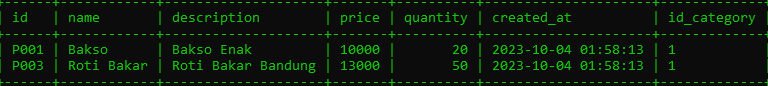
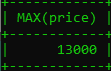

# Subqueries

---

## Subquery di WHERE

- MySQL mendukung pencarian data menggunakan WHERE dari hasil SELECT query
- Fitur ini dinamakan Subquery
- Contoh, kita ingin mencari products yang harganya diatas harga rata-rata, artinya kita akan melakukan SELECT dengan WHERE price > harga rata, dimana harga rata-rata perlu kita hitung menggunakan query SELECT lainnya menggunakan aggregate function AVG

---

## Melakukan Subquery di WHERE Clause

```sql
SELECT *
FROM products
WHERE price > (SELECT AVG(price) FROM products);
```

**Hasil :**



---

## Subquery di FROM

- Selain di WHERE clause, Subquery juga bisa dilakukan di FROM clause
- Misal kita ingin mencari data dari hasil query SELECT, itu bisa kita lakukan di MySQL

---

## Melakukan Subquery di FROM Clause

```sql
SELECT MAX(price)
FROM (
    SELECT price
    FROM categories
    INNER JOIN products
    ON (products.id_category = categories.id)
) AS cp;
```

**Hasil :**

