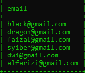
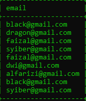
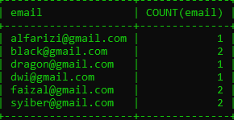
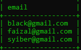
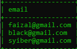
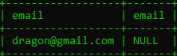

# Set Operator

---

## Set Operator

MySQL mendukung operator Set, dimana ini adalah operasi antara hasil dari dua SELECT query. Ada banyak jenis operator Set, yaitu :
- UNION
- UNION ALL
- INTERSECT, dan
- MINUS

---

## Membuat Table Guest Book

```sql
CREATE TABLE guestbooks
(
    id INT NOT NULL AUTO_INCREMENT,
    email VARCHAR(100) NOT NULL,
    title VARCHAR(200) NOT NULL,
    content TEXT,
    PRIMARY KEY (id)
) ENGINE = InnoDB;
```

---

## UNION

- UNION adalah operasi menggabungkan dua buah SELECT query, dimana jika terdapat data yang duplikat, data duplikatnya akan dihapus dari hasil query

---

## Diagram UNION


---

## Melakukan Query UNION

```sql
SELECT DISTINCT email FROM customers
UNION
SELECT DISTINCT email FROM guestbooks;
```

**Hasil :**



---

## UNION ALL

- UNION ALL adalah operasi yang sama dengan UNION, namun data duplikat tetap akan ditampilkan di hasil query nya

---

## Diagram UNION ALL


---

## Melakukan Query UNION ALL

```sql
SELECT DISTINCT email FROM customers
UNION ALL
SELECT DISTINCT email FROM guestbooks;
```

**Hasil :**



```sql
SELECT email, COUNT(email)
FROM (
    SELECT DISTINCT email FROM customers
    UNION ALL
    SELECT DISTINCT email FROM guestbooks
) AS emails
GROUP BY email;
```

**Hasil :**



---

## INTERSECT

- INTERSECT adalah operasi menggabungkan dua query, namun yang diambil hanya data yang terdapat pada hasil query pertama dan query kedua
- Data yang tidak hanya ada di salah satu query, kan dihapus di hasil operasi INTERSECT
- Data nya muncul tidak dalam keadaan duplikat
- Sayangnya, MySQL tidak memiliki operator INTERSECT, dengan demikian untuk melakukan operasi INTERSECT, kita harus lakukan secara manual menggunakan JOIN atau SUBQUERY

---

## Diagram INTERSECT


---

## Melakukan Query INTERSECT

```sql
SELECT DISTINCT email FROM customers
WHERE email IN (SELECT DISTINCT email FROM guestbooks);
```

**Hasil :**



```sql
SELECT DISTINCT customers.email FROM customers
INNER JOIN guestbooks ON (guestbooks.email = customers.email);
```

**Hasil :**



---

## MINUS

- MINUS adalah operasi dimana query pertama akan dihilangkan oleh query kedua
- Artinya jika ada data di query pertama yang sama dengan data yang ada di query kedua, maka data tersebut akan dihapus dari hasil query MINUS
- Sayang nya, di MySQL juga tidak ada operator MINUS, namun hal ini bisa kita lakukan menggunakan JOIN

---

## Diagram MINUS


---

## Melakukan Query MINUS

```sql
SELECT DISTINCT customers.email, guestbooks.email FROM customers
LEFT JOIN guestbooks ON (guestbooks.email = customers.email)
WHERE guestbooks.email IS NULL;
```

**Hasil :**

